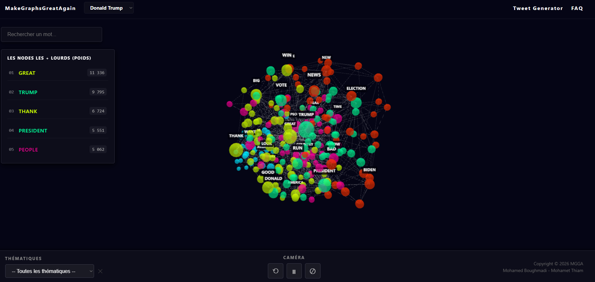

<div align="center">

  
  <h1>M A K E G R A P H S G R E A T A G A I N</h1>

  <p><b>La politique américaine, visualisée en 3D.
    <br />Interactif . Analytique . Immersif .</b></p>

  <p>
    <a href="#"></a>
    <a href="#"></a>
    <a href="https://make-graphs-great-again.vercel.app/index.html"></a>
    <a href="https://opensource.org/licenses/MIT"></a>
  </p>

  <br />

  <a href="https://make-graphs-great-again.vercel.app/index.html" target="_blank">
    
  </a>

  <br /><br />

  <h2><a href="https://make-graphs-great-again.vercel.app/index.html">Essayer maintenant</a></h2>
  <br />

  <p><i>Propulsé par les meilleures technologies de visualisation 3D</i></p>

  <p>
    
    
    
    
    
    
  </p>

  <hr />
</div>

<br />

> **MakeGraphsGreatAgain** est une plateforme de visualisation NLP interactive en 3D des discours politiques américains. Explorez les réseaux sémantiques de **Donald Trump**, **Joe Biden** et **Barack Obama** à travers des graphes de force immersifs, et découvrez les mots, thèmes et connexions qui structurent leur langage.

---

## ✨ Fonctionnalités Clés

### 🌐 Visualisation 3D
- **Graphe de Force 3D** : Navigation immersive dans un réseau de mots co-occurrents, rendu en temps réel avec Three.js.
- **3 Corpus Politiques** : Basculez entre les univers lexicaux de Trump, Biden et Obama en un clic.
- **Labels Dynamiques** : Affichage intelligent des étiquettes selon le poids des nœuds, avec mise en surbrillance au focus.
- **Rotation Automatique** : Animation fluide de la scène, pausable à tout moment.

### 🔍 Exploration & Analyse
- **Recherche de Mots** : Localisez instantanément n'importe quel mot dans le graphe avec zoom automatique.
- **Shortest Path** : Trouvez le chemin sémantique le plus court entre deux mots via un algorithme BFS.
- **Top 5 des Nœuds** : Visualisez les mots les plus influents du corpus au chargement.
- **Filtres Thématiques** : Isolez les clusters sémantiques (Slogans, Nation, Politique, Sécurité...) par président.

### 🤖 Générateur de Tweets
- **Génération NLP** : Créez des tweets dans le style de chaque président à partir de l'analyse lexicale des corpus.

### 🎨 Interface & UX
- **Design Spatial** : Interface sombre et immersive pensée pour la visualisation de données.
- **Panneau d'Informations** : Détails en temps réel sur chaque nœud (poids, connexions, thème, top associés).
- **Notifications Toast** : Feedback non-bloquant pour tous les événements du graphe.

---

## 📸 Aperçu de l'Interface

| Graphe 3D Principal | Filtres Thématiques |
| :--- | :--- |
|  |  |

| Recherche & Shortest Path | Générateur de Tweets |
| :--- | :--- |
|  |  |

---

## 🚀 Technologies Utilisées

| Secteur | Technologie |
| :--- | :--- |
| **Visualisation 3D** | [Three.js](https://threejs.org/) + [3D-Force-Graph](https://github.com/vasturiano/3d-force-graph) |
| **Labels 3D** | [three-spritetext](https://github.com/vasturiano/three-spritetext) |
| **Frontend** | HTML5 / CSS3 / JavaScript Vanilla |
| **Traitement NLP** | Python (génération des graphes JSON) |
| **Déploiement** | [Vercel](https://vercel.com/) |

---

## 🧠 Architecture des Données

Les graphes sont générés en amont via un pipeline Python NLP :

```
Discours bruts (.txt)
        ↓
  Nettoyage & Tokenisation
        ↓
  Calcul des co-occurrences
        ↓
  Clustering (Louvain / k-means)
        ↓
  Export JSON (nodes + links)
        ↓
  Visualisation 3D (3d-force-graph)
```

Chaque nœud JSON contient :
```json
{
  "id": "great",
  "val": 11336,
  "group": 0
}
```

---

## 🛠️ Installation et Lancement

### 1. Clonage du repo
```bash
git clone https://github.com/boughbough/MakeGraphsGreatAgain.git
cd MakeGraphsGreatAgain
```

### 2. Lancement local
Aucune dépendance à installer — le projet est en HTML/JS vanilla avec des CDN.  
Ouvrez simplement `index.html` dans votre navigateur, ou lancez un serveur local :

```bash
# Avec Python
python -m http.server 8000

# Avec Node.js
npx serve .
```

### 3. Accéder à l'application
```
http://localhost:8000
```

---

## 👥 Auteurs

<div align="center">

| Mohamed Boughmadi | Mohamet Thiam |
| :---: | :---: |
| [](https://github.com/boughbough) | [](https://github.com/) |

</div>

---

## 📝 Licence

Ce projet est sous licence MIT. Libre à vous de l'utiliser, le modifier et le distribuer.

---

<div align="center">
  <p>⭐ Si le projet vous plaît, n'hésitez pas à laisser une étoile sur <a href="https://github.com/boughbough/MakeGraphsGreatAgain">GitHub</a> !</p>
</div>
